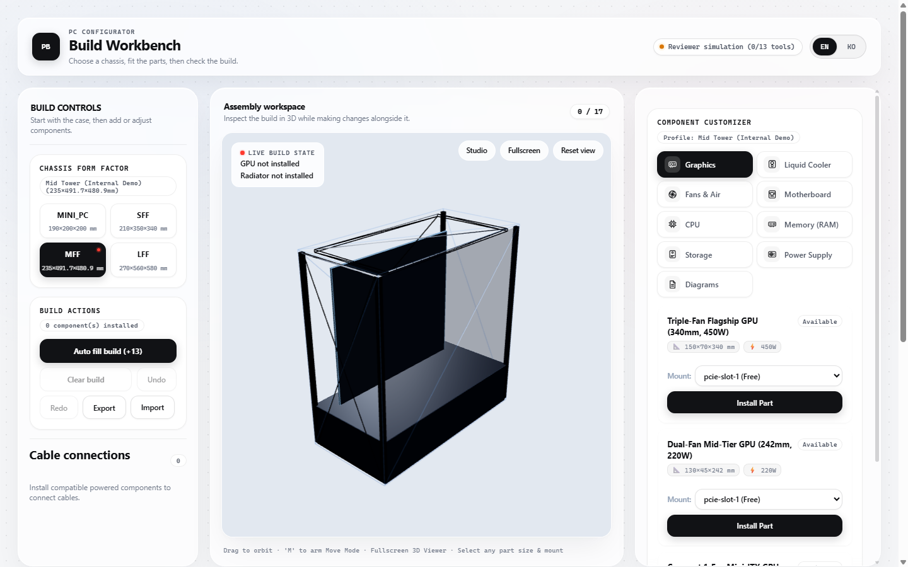
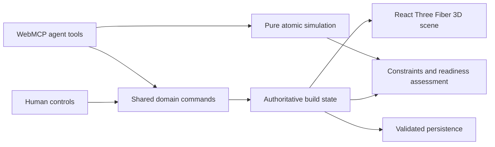

# Build State Studio

Build State Studio is a collaborative 3D PC assembly workspace for humans and AI agents. A shared deterministic build topology drives the GUI, React Three Fiber scene, compatibility checks, atomic simulations, undo history, and a 16-tool WebMCP interface.



## The problem

PC assembly requires reasoning across physical clearances, platform compatibility, power capacity, connector direction, cable occupancy, and airflow. A visual-only agent must infer all of that from pixels and then guess which controls to click. Build State Studio exposes the underlying assembly model as structured WebMCP tools, so an agent can inspect the same state the user sees, simulate a repair, apply it through the same domain commands, and show the result immediately in the 3D workspace.

## Why WebMCP

The useful interaction is not “ask an AI for a parts list.” It is a shared workspace in which a person and an agent can take turns editing one authoritative build:

1. A person installs a long GPU and a front radiator, creating a clearance conflict.
2. The agent reads the topology and readiness assessment instead of scraping the DOM.
3. The agent discovers valid mounts and connector IDs from the catalog and case tools.
4. It simulates moving the radiator to the top without mutating live state.
5. It commits the move through the same command layer used by the GUI.
6. The person sees the 3D model move and can continue editing or undo the agent action.

Without WebMCP, the agent has to reconstruct hidden domain state from the interface. With WebMCP, both participants operate on the same typed, deterministic model.

## 30-second local demo

```bash
npm install
npm run dev
```

Open the printed local URL, click **Auto fill build**, then use the reviewer simulation panel when WebMCP transport is unavailable. In a WebMCP-enabled client, try:

> Inspect this PC build. If it is incomplete or conflicted, discover the available parts and mounts, simulate the smallest safe fix, apply it, and validate the result. Do not replace the GPU.

Useful follow-up prompts:

- “Which required power cables are still missing? Connect them using discovered connector IDs.”
- “Show me the differences between the available case profiles before changing the case.”
- “Disconnect the GPU power cable, explain the readiness change, then undo your action.”

## Architecture



All live mutations pass through `commitDomainAction`, which updates topology revision, bounded activity history, and undo/redo state atomically. `simulate_changes` uses pure transitions and never writes to the live store. The GUI, 3D mount interaction, persistence validator, and WebMCP mount discovery reuse the same compatibility guards.

## WebMCP tools

The tools are registered with `document.modelContext.registerTool()` using strict object schemas (`additionalProperties: false`) and per-tool abort signals.

### Read-only discovery and assessment

1. `get_build_state` — topology, connections, fan configuration, activity, revision, and undo availability.
2. `get_component_catalog` — component IDs, dimensions, power, compatibility, and connector IDs/types/directions; optionally filtered by type.
3. `get_case_profiles` — case dimensions, motherboard support, mounts, clearances, and recommended fan metadata.
4. `get_available_mounts` — compatible unoccupied mounts using the shared case and cooling-zone rules.
5. `validate_build` — `READY`, `INCOMPLETE`, or `CONFLICT`, plus issues, missing essential component types, missing power connections, and a summary.

### Mutations and simulation

6. `install_component`
7. `move_component`
8. `remove_component`
9. `connect_component`
10. `disconnect_component`
11. `set_fan_direction`
12. `simulate_changes`
13. `select_case`
14. `auto_fill_build`
15. `clear_build`
16. `undo_last_agent_action`

## Product capabilities

- Four case profiles with case-specific dimensions, motherboard support, camera framing, fan locations, and mount limits.
- A deterministic command and transaction engine with monotonic revisions, atomic composite actions, simulation, and stale-safe agent undo.
- Compatibility checks for case clearance, motherboard form factor, CPU socket, memory generation, GPU/radiator collision, GPU cable space, PSU capacity/connectors, and airflow.
- A readiness layer that distinguishes blocking conflicts from incomplete builds and non-blocking warnings.
- Validated JSON import/export that checks placements, connector existence/direction/type/occupancy, fan configuration, and blocking domain issues before replacing live state.
- An interactive 3D scene with mount selection, fan direction controls, collision highlighting, and recoverable scene errors.
- English and Korean UI.

## Prototype scope and extensibility

The catalog is intentionally constrained for a deterministic hackathon demonstration. Several case profiles and physical rules are simplified models rather than a production hardware database. Component data, case profiles, mounts, constraints, commands, and rendering are separated so manufacturer catalogs and more detailed geometry rules can be added without changing the WebMCP interaction model.

## Verification

```bash
npm test
npx tsc -b
npm run build
```

The automated suite covers command invariants, compatibility constraints, readiness assessment, WebMCP registration and strict schemas, catalog/case discovery, connect/disconnect parity, read purity, atomic simulation rollback, persistence validation, scene transforms, and UI regressions. CI runs the same test, type-check, and production-build gates on pushes and pull requests.

Automated mocks verify the WebMCP contract, but a release candidate must also be exercised in an actual WebMCP-enabled Chrome or ChatGPT in-app browser session. Record the client and successful tool sequence in the Devpost submission rather than claiming mock tests as client validation.

## License and asset attribution

Source code is available under the [MIT License](LICENSE). Third-party or reconstructed visual assets retain their own attribution and license notes under `public/assets/**/ATTRIBUTION.md`.
