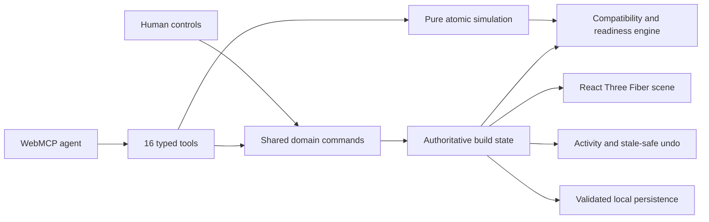

# Build State Studio

**A shared 3D PC assembly workspace where people and AI agents inspect, simulate, and repair the same build.**

Built for [The WebMCP Challenge](https://webmcp.devpost.com), Build State Studio turns a visual PC configurator into an agent-native application. The interface and its 16 WebMCP tools share one deterministic domain model, so an agent can reason from structured hardware state instead of guessing from pixels or manipulating the DOM.

[Live demo](https://ai-pc-assembly-workspace.aigenerator04.chatgpt.site) · [WebMCP Challenge](https://webmcp.devpost.com) · [MIT License](LICENSE)


## The problem

PC building is a spatial and systems problem. A valid build depends on case dimensions, motherboard form factor, CPU socket, memory generation, GPU and radiator clearance, PSU capacity, cable types, connector occupancy, and airflow direction.

A conventional visual configurator hides most of that meaning inside controls and rendered geometry. An AI agent must infer state from the screen, discover interaction targets, and hope every click had the intended effect. This becomes unreliable precisely when the task is most useful: diagnosing a conflict and coordinating several dependent changes.

Build State Studio exposes the underlying assembly model directly through WebMCP. Humans keep the tactile visual workflow; agents gain a typed, inspectable, and safe action surface.

## What people and agents can do together

Consider a build with a long GPU and a front-mounted radiator that occupy the same physical clearance zone:

1. The person sees the collision highlighted in the 3D workspace.
2. The agent calls `get_build_state` and `validate_build` to inspect the authoritative topology and diagnosis.
3. The agent discovers legal alternatives with `get_available_mounts` rather than guessing a mount ID.
4. The agent calls `simulate_changes` to preview moving the radiator without touching the live build.
5. After the plan validates, the agent commits the move with `move_component`.
6. The 3D scene, readiness status, activity history, persistence layer, and undo state update together.
7. The person can continue manually or undo the agent's latest safe action.

This is the core idea: WebMCP is not a chat layer beside the product. It is another trusted way to operate the product's real domain commands.

## Why WebMCP matters here

| Without WebMCP | With Build State Studio's WebMCP surface |
| --- | --- |
| Reconstruct the build from pixels and labels | Read placements, cables, fan configuration, issues, and revision as structured data |
| Guess component, connector, and mount identifiers | Discover valid IDs and compatibility metadata from read-only tools |
| Apply a sequence and hope intermediate steps succeed | Simulate the entire sequence atomically before committing |
| Mutate the interface through fragile selectors | Reuse the same guarded command layer as the GUI |
| Risk undoing newer human work | Permit agent undo only when no later topology change would be lost |

The result is faster and more reliable task completion while keeping the human-visible workspace authoritative.

## Try the core flow

### Run locally

Requirements: Node.js 20.19+ or 22.12+ and npm.

```bash
npm install
npm run dev
```

Open the local URL printed by Vite and select **Auto fill build**. The app displays a reviewer simulation panel when the browser does not expose WebMCP, so the read, validate, simulate, and move flow remains demonstrable in a standard browser.

### Run with a WebMCP agent

Use either:

- ChatGPT's in-app browser, which supports WebMCP; or
- a WebMCP-enabled version of Chrome with `chrome://flags/#enable-webmcp-testing` enabled and the browser restarted.

Open the app, auto-fill a build, and give the agent this task:

> Inspect this PC build. If it is incomplete or conflicted, discover the available parts and mounts, simulate the smallest safe fix, apply it, and validate the result. Do not replace the GPU.

Useful follow-ups:

- “Which required power cables are missing? Connect them using connector IDs you discover from the app.”
- “Compare the available case profiles before changing the case.”
- “Disconnect the GPU power cable, explain the readiness change, then undo your action.”
- “Check the current airflow layout and correct any fan facing the wrong direction.”

The header reports whether all 16 tools registered successfully. Chrome DevTools can also show the registered WebMCP tools under the Application panel.

## WebMCP tool surface

Tools are registered with `document.modelContext.registerTool()` using strict object schemas with `additionalProperties: false`. Read operations are side-effect free; mutations go through guarded domain commands.

### Inspect and reason

| Tool | Purpose |
| --- | --- |
| `get_build_state` | Read placements, connections, fan settings, activity, revision, and undo availability |
| `get_component_catalog` | Discover component IDs, dimensions, power data, compatibility, and typed connectors |
| `get_case_profiles` | Compare case dimensions, supported form factors, mounts, clearances, and fan guidance |
| `get_available_mounts` | Find compatible, unoccupied mounts for the active case and optional component |
| `validate_build` | Return `READY`, `INCOMPLETE`, or `CONFLICT` with actionable details |

### Simulate and act

| Tool | Purpose |
| --- | --- |
| `simulate_changes` | Evaluate a typed sequence atomically without changing live state |
| `install_component` | Install a catalog component in a compatible free mount |
| `move_component` | Move an installed component to a compatible free mount |
| `remove_component` | Remove a component and dependent cables or fan configuration |
| `connect_component` | Connect compatible output and input connectors |
| `disconnect_component` | Remove a cable by its discovered connection ID |
| `set_fan_direction` | Set an installed fan to `INTAKE` or `EXHAUST` |
| `select_case` | Change the active case through the shared command path |
| `auto_fill_build` | Fill compatible empty mounts deterministically |
| `clear_build` | Clear non-case components only with explicit confirmation |
| `undo_last_agent_action` | Undo the latest agent mutation only when it is still safe |

## Architecture



Every live topology change passes through `commitDomainAction` or `commitDomainActions`. That boundary applies domain guards, records the actor and affected components, advances a monotonic topology revision, and stores the snapshot needed for safe undo. `simulate_changes` uses the same pure transitions against a cloned state and rolls the whole projection back if any action fails.

The GUI, 3D mount interactions, imported build validator, and WebMCP tools therefore cannot drift into separate interpretations of compatibility.

## Product capabilities

- Interactive 3D assembly with orbit controls, mount selection, collision highlighting, airflow visualization, and recoverable scene errors
- Six case profiles ranging from compact Mini-ITX systems to ATX and full-tower layouts
- A curated component catalog covering cases, motherboards, CPUs, GPUs, memory, storage, cooling, fans, and power supplies
- Compatibility checks for physical clearances, motherboard form factor, CPU socket, memory generation, GPU/radiator overlap, GPU cable space, PSU capacity and connectors, and airflow
- Readiness assessment that separates blocking conflicts from missing components, missing power connections, and non-blocking warnings
- Atomic multi-action simulation, human undo/redo, and stale-safe agent undo
- Validated versioned JSON import/export and local persistence
- English and Korean interface with locale-aware KRW price display
- Optional Naver Shopping price refresh during local development, with catalog estimates as a fallback
- Responsive layouts for desktop, tablet, and mobile

## Safety and reliability

Agent access is deliberately constrained:

- Tool inputs reject unknown fields and invalid enum values.
- IDs must be discovered from the current catalog, case profile, or build state.
- Mount occupancy, physical fit, platform compatibility, connector direction, connector type, and connector reuse are enforced below both UI and agent actions.
- Simulations never mutate the live store.
- `clear_build` requires `confirm: true`.
- Agent undo is rejected if a later human or agent change could be overwritten.
- Imported JSON is validated before it can replace the active build.
- Registration and invocation outcomes are recorded in in-memory telemetry for runtime diagnostics.

## Development

```bash
# Install dependencies
npm install

# Start the Vite development server
npm run dev

# Run the test suite once
npm test

# Type-check and create a production build
npm run build

# Preview the production build
npx vite preview
```

### Optional live price lookup

The local Vite server and preview server expose `/api/prices`. To enable Naver Shopping results, provide these environment variables before starting the app:

```bash
NAVER_CLIENT_ID=your_client_id
NAVER_CLIENT_SECRET=your_client_secret
```

Credentials remain server-side. If they are absent or the lookup fails, the interface continues to use deterministic estimated prices.

## Verification

```bash
npm test
npx tsc -b
npm run build
```

The automated suite covers domain command invariants, compatibility constraints, readiness assessment, catalog and case discovery, strict WebMCP schemas, tool registration, read purity, connection parity, atomic simulation rollback, persistence validation, scene transforms, asset integrity, and UI regressions.

Automated tests mock the browser WebMCP API. Before publishing a release, also exercise the deployed app in ChatGPT's in-app browser or WebMCP-enabled Chrome and record the successful client and tool sequence.

## Project structure

```text
src/
  app/                 Application shell and runtime status
  components/build/    Human build, validation, activity, and review controls
  components/scene/    React Three Fiber scene and component renderers
  domain/              Components, cases, commands, constraints, and simulation
  i18n/                English/Korean strings and locale helpers
  scene/               Mount transforms, layout, camera, and model registry
  store/               Shared Zustand state and validated persistence
  webmcp/              Tool schemas, registration, implementations, and telemetry
server/                 Optional Naver Shopping price adapter for Vite
public/assets/          GLB assets, manifests, validation reports, and attribution
docs/                   Implementation notes and screenshots
tests/                  Repository-level integrity tests
```

## Technology

- React 19 and TypeScript
- Vite
- React Three Fiber, Drei, and Three.js
- Zustand
- Vitest
- WebMCP imperative API

## Prototype scope

Build State Studio is a hackathon prototype, not a substitute for manufacturer documentation or a professional system integrator. The catalog is intentionally bounded, prices can be estimates, and some case geometry is represented by simplified clearance envelopes. The architecture keeps catalog data, case profiles, mounts, constraints, commands, and rendering separate so more manufacturers, components, and higher-fidelity geometry can be added without changing the human-agent collaboration model.

## License and asset attribution

The source code is released under the [MIT License](LICENSE). Third-party and reconstructed visual assets retain their own license and attribution notes under `public/assets/**/ATTRIBUTION.md`.

WebMCP resources: [specification](https://webmachinelearning.github.io/webmcp/) · [Chrome developer guide](https://developer.chrome.com/docs/ai/webmcp) · [tool security guidance](https://developer.chrome.com/docs/ai/webmcp/secure-tools)
